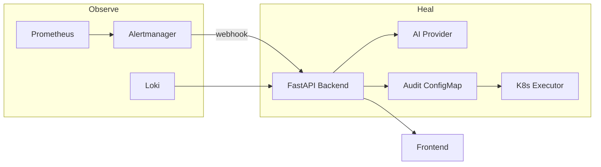

# Architecture

## Components

| Layer | Technology | Role |
|-------|------------|------|
| UI | React + nginx | ChatOps console |
| API | FastAPI | Analyze, remediate, webhooks |
| AI | Ollama / OpenAI | Structured JSON root-cause |
| Execution | kubernetes-python | Deployment restart/rollback/scale |
| Audit | ConfigMap | Immutable decision ledger |
| Metrics | Prometheus | CPU, memory, restarts, availability |
| Logs | Loki (+ K8s API fallback) | Log aggregation & query |
| Viz | Grafana | Dashboards |
| Delivery | Helm + Argo CD | GitOps deployments |
| CI | GitHub Actions | Build, push, tag bump |

## Data flow

1. Prometheus scrapes workload metrics and evaluates alert rules.
2. Alertmanager sends firing alerts to `POST /webhooks/alerts`.
3. Backend collects logs (Loki preferred, else pod logs via API).
4. AI returns structured JSON: root cause, confidence, remediation.
5. Guardrails + audit ledger gate any mutation.
6. Executor applies deployment-level remediation (Option A).
7. Frontend and Grafana surface status and history.

## Safety model

- **Fail-closed audit**: no K8s change without persisted `PENDING` record.
- **Guardrails**: namespace allowlist, confidence threshold, cooldown, max retries.
- **Deployment-only mutations**: no direct pod deletes.
